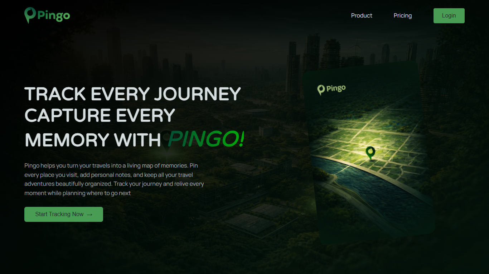
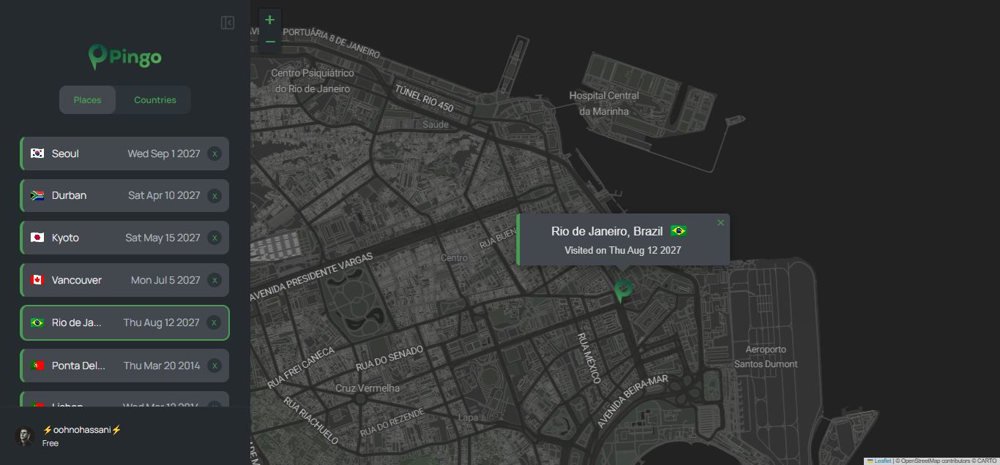

# 🌍 Pingo — Travel Tracking & Planning App

**Pingo** is a travel tracking and planning app that lets users map visited cities, save notes and memories, and organize trips visually. With personalized recommendations and smart planning tools, it helps travelers relive past journeys and discover new destinations. 🌍✈️

### 🔗 Live Demo

👉 [https://pingo-oohnohassani.netlify.app/](https://pingo-oohnohassani.netlify.app/)

### 📸 App Preview

<!--  -->



### ✨ Features

- 📍 **Geolocation Integration**
  Automatically detects and centers the map based on the user’s current location.

- 🗺️ **Interactive Maps (Leaflet)**
  Smooth and dynamic map experience powered by React Leaflet.

- 📌 **Track Visited Cities**
  Click anywhere on the map to add and save locations.

- 📝 **Notes & Memories**
  Store travel details, dates, and personal notes for each place.

- 🔐 **Authentication & Protected Routes**
  Secure parts of the app with login logic and route protection.

- 🔄 **Client-Side Routing (React Router)**
  Fast navigation without page reloads.

- 🌐 **Fetch API Integration**
  Handles communication with the backend.

- 🧠 **Global State Management (Context API)**
  Clean and scalable state handling across the app.

- 🗄️ **JSON Server (Mock Backend)**
  Simulates a real backend for storing and retrieving travel data.

- ⚡ **Vite Powered**
  Lightning-fast development and build performance.

### 🛠️ Tech Stack

- **Frontend:** React + Vite
- **Routing:** React Router
- **Maps:** React Leaflet
- **State Management:** Context API
- **Data Fetching:** Fetch API
- **Backend:** JSON Server
- **Authentication:** Custom auth system
- **Styling:** CSS Modules

### 🚀 Getting Started

Follow these steps to run the project locally:

#### 1. Clone the repository

```bash
git clone https://github.com/Oohnohassani/Pingo.git
cd Pingo
```

#### 2. Install dependencies

```bash
npm install
```

#### 3. Start JSON Server (Backend)

```bash
npm run server
```

- Starts the mock API (typically on `http://localhost:8000`)
- Stores your places and travel data

#### 4. Start the Development Server

Open a new terminal:

```bash
npm run dev
```

Then visit:

```
http://localhost:5173
```

### ⚠️ Important Notes

- You must run **both servers simultaneously**:
  - JSON Server → backend
  - Vite → frontend

- 🌐 **Geolocation requires browser permission**
  If denied, location-based features will be limited.

### 📂 Project Structure

```
src/
├── components/   # Map, UI elements, forms
├── contexts/     # Global state (Places, Auth)
├── hooks/        # Custom hooks (useGeolocation)
├── pages/        # Route-based pages
├── utils/        # Helper functions
```

### 🔮 Future Improvements

- 🌍 Replace JSON Server with a real backend (Node.js / Firebase)
- 🔎 Add search & filtering for places
- 📱 Improve mobile responsiveness
- 🤝 Enable trip sharing & collaboration
- 🧭 Advanced trip planning tools

### 👨‍💻 Author

This project showcases:

- Real-world React architecture
- API integration & async handling
- Authentication & protected routing
- Interactive maps & geolocation
- Scalable state management

Happy coding ✌️
